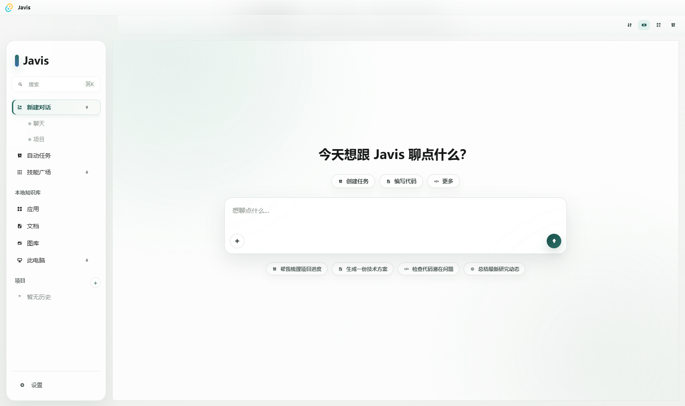
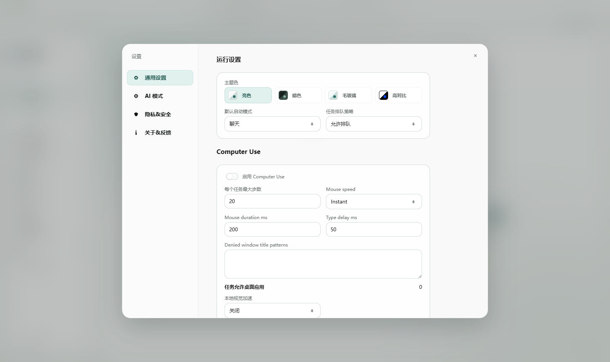
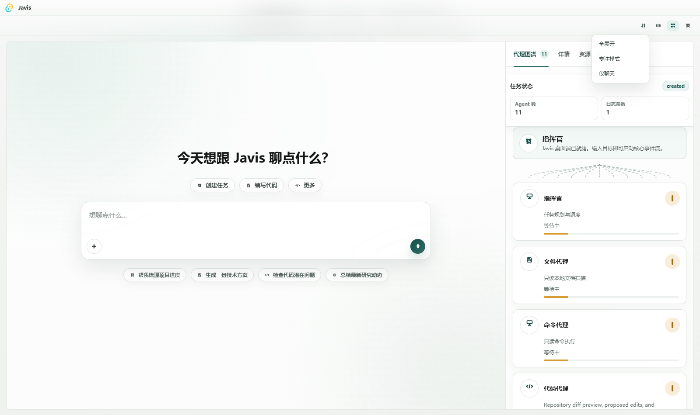
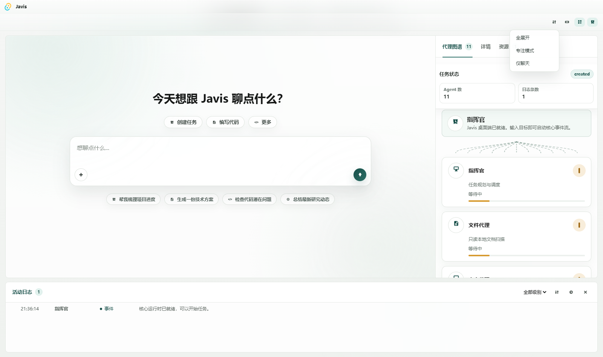

# Javis

Javis 是一个本地优先的桌面 Agent 工作台，面向“让 AI 真正参与日常项目工作”这个目标构建。它不是只把聊天窗口搬到桌面上，而是把任务拆解、工具调用、证据记录、权限审批和结果恢复都放进同一个可观察的界面里。

当前版本仍处在产品化打磨阶段，但已经具备一个可运行的 Windows 桌面原型：你可以选择项目目录，发起研究、项目检查、文档扫描、代码审查和文件整理任务，并在写入本地文件之前看到明确的 dry-run / approval 流程。

```text
用户目标 -> Commander 规划 -> Agent / Tool 执行 -> Verifier 校验 -> 桌面 UI 展示结果
```

## 截图预览

<table>
  <tr>
    <td width="50%">
      
      <br>
      <sub>当前工作台：侧边栏、任务入口、快捷提示和 Inspector 入口集中在一个桌面界面里。</sub>
    </td>
    <td width="50%">
      
      <br>
      <sub>运行设置：主题、启动模式、任务队列策略、Computer Use 和本地视觉相关选项。</sub>
    </td>
  </tr>
  <tr>
    <td width="50%">
      
      <br>
      <sub>Agent 图谱：展示当前任务状态、Agent 数量、日志数量和各 Agent 的运行状态。</sub>
    </td>
    <td width="50%">
      
      <br>
      <sub>活动日志：底部日志区和右侧 Inspector 能同时展示事件、资源和任务执行细节。</sub>
    </td>
  </tr>
</table>

这些截图来自当前代码运行后的前端界面，README 专用截图保存在 [docs/assets/readme](docs/assets/readme)。

## 为什么做 Javis

很多 Agent 工具的问题不是“不会生成答案”，而是下面这些日常细节没有被认真处理：

- 它读了哪些文件、跑了哪些命令，很难追踪。
- 它要写入文件时，用户很难知道具体会改什么。
- 失败之后没有清晰的状态、证据和恢复路径。
- 项目上下文、任务历史、审批记录经常随着会话结束而消失。
- 多个 Agent 的分工像黑盒，用户只能看到最后一段文字。

Javis 的设计重心是可见、可审计、可恢复。界面里同时展示主线程、计划步骤、Agent 状态、活动日志、权限卡片和结果快照，让用户知道 AI 在做什么、依据是什么、下一步会不会影响本地状态。

## 当前能力

### 桌面工作台

- 基于 Tauri + React 的桌面应用。
- 左侧管理对话、项目、历史、本地知识库、应用和设置。
- 中间主线程展示用户目标、计划、执行结果和输入框。
- 右侧 Inspector 展示 Agent 图谱、上下文、能力分数和资源状态。
- 底部活动区记录任务事件、工具调用、审批状态和执行时间线。

### 项目与文件理解

- 选择或恢复工作区路径。
- 扫描 Markdown / 文档类资源并生成摘要。
- 检查项目环境，识别 package scripts、推荐启动/测试命令。
- 通过只读 allowlist 运行环境检查，例如 Node、pnpm、git status 等。
- 仓库搜索和调用链追踪正在产品化：核心合约、rg 后端、证据报告和 UI 展示已接入，完整 packaged QA 仍在补齐。

### 研究与资料收集

- 支持基于用户提供 URL 的资料收集。
- 研究报告会保留来源、摘录、时间戳和 verifier 结果。
- 对来源之间的重合、差异和未知项做显式标注。
- 搜索型研究已接入 GitHub CLI 和 Agent Chrome 路径，部分 live / packaged QA 仍在进行。

### Code Agent

- 读取当前 git diff 和变更文件。
- 生成代码审查计划和候选 patch。
- 使用 opencode / OpenAI-compatible provider 作为 proposal backend。
- 应用补丁前需要经过 confirmed-write 审批。
- Native 层会检查 proposal hash、approval id、文件路径、当前文件 hash 和一次性消费状态。

Code Agent 已有 fixture QA 覆盖拒绝和批准路径；真实 provider 的 live smoke 仍是产品化 blocker，所以不要把它当成完全稳定的自动改代码工具。

### 本地状态与持久化

- 任务历史存储在本地 SQLite。
- 已完成、失败和取消任务可以在侧边栏恢复或删除。
- recent workspace、model settings、approval records、user preferences、task-session JSONL 等存储已完成迁移。
- Durable approval 已覆盖 PDF、Code Patch、Git stage / commit / push、PR create / comment 等路径的源级逻辑，部分 packaged QA 证据仍在补齐。

### 本地视觉与 Computer Use

- 仓库中包含 local-vision worker、ONNX Runtime 准备脚本和 Computer Use QA 入口。
- 目标是让桌面 Agent 能理解截图、UI 元素和操作反馈。
- 这部分仍在严格 QA 和发布资源打包阶段，不建议视为稳定公共接口。

## 安全模型

Javis 默认把“看见”和“改变”分开处理：

| 等级 | 含义 | 当前策略 |
| --- | --- | --- |
| `read` | 读取文件、列目录、运行安全的只读检查 | 可直接执行，但必须记录结果 |
| `preview` | 生成计划、diff、dry-run、候选操作 | 不改变本地状态 |
| `confirmed_write` | 写文件、移动文件、应用补丁、git 写操作 | 必须有当前可见审批 |
| `dangerous` | 高风险或难以恢复的操作 | 默认拒绝或需要更强约束 |

一个典型例子是 PDF 整理流程：

1. File Agent 先扫描 `Downloads` 并生成移动计划。
2. UI 展示源路径、目标路径、冲突和风险说明。
3. 用户点击批准后，native 层只执行这一次 dry-run 中列出的操作。
4. Verifier 再检查执行结果，并把证据写入任务记录。

API key 也不应该进入仓库。桌面端应使用系统凭据存储或 model profile 的 key reference；QA 脚本需要临时凭据时，使用环境变量，例如 `DEEPSEEK_API_KEY` 或 `JAVIS_OPENCODE_LIVE_API_KEY`。

## 技术栈

```text
TypeScript + React + Vite + Tauri + Rust
```

| 层 | 技术 | 职责 |
| --- | --- | --- |
| Desktop UI | React, TypeScript, Vite | 工作台布局、任务输入、结果展示、审批控件 |
| Core Runtime | TypeScript | 路由、计划、Agent 快照、权限状态、验证摘要 |
| Tool Contracts | TypeScript | 文件、Shell、Web、Git、Browser、Computer 等工具契约 |
| Native Bridge | Tauri, Rust | 文件系统、进程、HTTP、凭据和权限强制执行 |
| Code Proposal | opencode, provider adapters | 生成候选补丁，不直接绕过审批写入 |
| Persistence | SQLite, JSONL | 任务历史、审批记录、工作区和运行日志 |
| Tests / QA | Vitest, Cargo test, PowerShell QA | 源级测试、native 测试、打包应用证据 |

## 仓库结构

```text
apps/desktop
  Tauri + React 桌面应用，包含 UI 接入、native commands、sidecar 和图标资源。

packages/core
  Agent runtime、任务规划、工作流执行、权限状态、研究报告和恢复逻辑。

packages/tools
  工具描述、工具输入输出类型、权限等级和共享契约。

packages/ui
  可复用的工作台组件，例如 ThreadView、Inspector、ModelSettings、Workspace panels。

docs
  产品状态、架构、安全模型、QA 证据、发布流程和路线图。

scripts
  本地视觉、发布、QA、证据检查和辅助脚本。
```

## 快速开始

### 环境要求

- Windows 是当前桌面构建的主要目标平台。
- Node.js 20+ 或 22+。
- Corepack / pnpm 10.x。
- Rust stable toolchain。
- 构建安装包时需要 Tauri 2 对应的 Windows 构建依赖。

### 安装依赖

```sh
pnpm install
```

如果你的 Node 环境启用了 Corepack，也可以显式使用：

```sh
corepack pnpm install
```

### 运行桌面应用

```sh
pnpm dev
```

这会启动 Tauri 桌面壳和 Vite 开发服务。

### 只运行前端

```sh
pnpm --filter @javis/desktop dev
```

适合只调 UI，不需要 native command 的场景。

### 构建前端包

```sh
pnpm --filter @javis/desktop build
```

### 构建 Windows 桌面安装包

```sh
pnpm desktop:build
```

该命令会准备 local-vision 发布资源，然后通过 Tauri 生成 Windows bundle。

## 验证命令

完整检查：

```sh
pnpm check
```

常用单项检查：

```sh
pnpm typecheck
pnpm test
pnpm rust:check
pnpm rust:test
pnpm --filter @javis/desktop build
```

产品工作流 QA：

```sh
pnpm qa:product-workflows
pnpm qa:computer-use
```

这些 QA 命令会检查截图、日志和结构化证据。部分 live provider 场景需要临时环境变量或人工打包应用证据。

## 配置模型与密钥

Javis 支持多个模型 provider / profile。配置入口在桌面应用的模型设置中，核心原则是：

- 不把 API key 写入源码、README、脚本或提交历史。
- 桌面应用通过 native secret storage 保存密钥。
- 测试脚本只读取环境变量。
- provider 报错、日志和诊断信息需要经过 redaction。

示例：

```powershell
$env:DEEPSEEK_API_KEY = "your-temporary-key"
powershell -File scripts/qa/verify-deepseek-proposal.ps1
```

运行结束后建议清理当前 shell 里的临时变量。

## 当前阶段

Javis 当前不是“完成品发布版”，而是一个可运行、可验证、正在收敛到完整产品的桌面 Agent 项目。

已经比较扎实的部分：

- 桌面工作台和任务可视化。
- 本地项目检查、资料收集、PDF dry-run 审批。
- SQLite 持久化迁移。
- 多类 confirmed-write 的源级安全绑定。
- Windows 打包路径和 QA 证据目录。

仍在补齐的部分：

- 真实 provider 下 Code Agent live proposal / apply QA。
- Git remote / PR 写操作的 packaged QA。
- Browser 写操作和 Terminal 交互审批的 packaged QA。
- repo intelligence、trend hot list、agent memory embeddings 的 live / packaged evidence。
- 签名发布、版本校验和 rollback evidence。

最权威的状态以 [Product Readiness](docs/PRODUCT_READINESS.md) 为准。

## 文档入口

- [Documentation Index](docs/README.md)
- [Product Readiness](docs/PRODUCT_READINESS.md)
- [MVP Status](docs/MVP_STATUS.md)
- [Security Model](docs/SECURITY_MODEL.md)
- [Development Guide](docs/DEVELOPMENT.md)
- [Troubleshooting](docs/TROUBLESHOOTING.md)
- [Manual QA Checklist](docs/QA_CHECKLIST.md)
- [Release Guide](docs/RELEASE.md)
- [Build / Sign / Release Runbook](docs/BUILD_SIGN_RELEASE_RUNBOOK.md)
- [Roadmap](docs/ROADMAP.md)
- [Contributing](CONTRIBUTING.md)

## English Summary

Javis is a local-first desktop Agent workbench built with TypeScript, React, Tauri, and Rust. It focuses on visible and auditable task execution: plans, tool calls, verifier results, permission cards, logs, and task history are shown in the desktop UI instead of being hidden behind a chat-only interface.

The project already has a runnable Windows desktop prototype with project inspection, source-backed research, document scanning, Code Agent proposal flows, local persistence, and confirmed-write approval paths. It is still under active product hardening, especially around live provider QA, packaged workflow evidence, browser / terminal approvals, and signed release operations.

## License

GPL-3.0-only. See [LICENSE](LICENSE).
