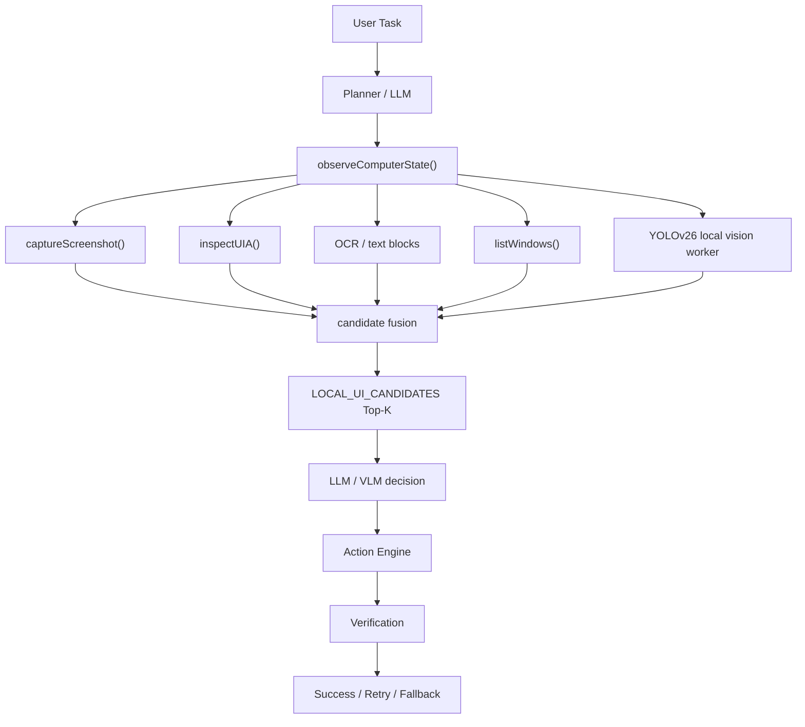

# Javis Computer Use 引入 YOLOv26 本地视觉模型改造方案

## 1. 方案结论

Javis 可以引入 YOLOv26 作为 Computer Use 的本地快速视觉定位层，用来更快发现屏幕上的按钮、输入框、菜单、弹窗、图标、列表区域等候选目标。但 YOLOv26 只能提供候选位置，不能作为决策层，也不能直接授权高风险动作。

核心原则：

```text
YOLOv26：发现屏幕上可能存在的视觉候选区域
UIA：提供可靠的控件结构和可执行控件入口
OCR：补充文字证据
VLM：负责视觉语义确认
LLM：负责规划和决策
Action Engine：负责动作执行
Verification：负责执行后验证和失败回退
```

一句话定位：

> YOLOv26 是本地视觉候选层，不是 Computer Use 的主脑。

第一版推荐只做 `passive` 和 `prompt_hint` 两种模式：本地检测可选、默认关闭、可超时、可降级。它的结果只作为结构化候选摘要进入 prompt，不直接改变敏感操作的授权逻辑。

## 2. 背景问题

当前 Computer Use 链路容易遇到这些问题：

1. 每轮都让 VLM 看完整截图，延迟和视觉 token 成本较高。
2. UIA 在部分软件、浏览器、Electron、游戏化 UI、Canvas UI 中不完整。
3. 大模型需要从整屏中自行搜索目标，视觉搜索成本高。
4. 截图、UIA、VLM、LLM 串行执行时，用户容易感知到长时间等待。
5. 动作失败后缺少局部候选区域，回退策略不够细。
6. 截图、裁剪图、base64 如果进入历史，会污染上下文，甚至几张图片就把上下文撑满。

因此需要一个轻量、本地、短超时、可丢弃旧结果、可完全关闭的视觉候选检测模块。

## 3. 改造目标

目标：

1. 降低 Computer Use 单步平均耗时。
2. 降低完整截图 VLM 调用次数。
3. 提升按钮、输入框、弹窗、图标等 UI 区域定位速度。
4. 只把结构化 Top-K 候选信息写入 prompt，避免图片进入长期上下文。
5. 本地检测失败、超时、模型缺失时不影响主流程。
6. YOLOv26 不直接授权敏感动作。
7. UI 不因本地模型加载或推理出现长时间未响应。

非目标：

1. 不让 YOLOv26 替代 LLM 或 VLM 做语义决策。
2. 不让 YOLOv26 独立决定提交、删除、付款、覆盖保存、输入密码等动作。
3. 不做持续 30 FPS 的屏幕实时检测。
4. 不把截图、裁剪图、base64 长期写入 prompt、任务历史或持久化记录。
5. MVP 阶段不强依赖专用 GPU。
6. MVP 阶段不启用激进的自动点击辅助。

## 4. 总体架构

推荐链路：



关键点：

1. 截图、UIA、窗口枚举、本地视觉并行执行。
2. 本地视觉必须有短超时预算，超时返回空结果。
3. 本地视觉结果必须绑定 `observationId` 和 `screenshotId`。
4. 旧截图的检测结果必须丢弃，不能污染新一轮观察。
5. prompt 只接收融合后的 Top-K 文本候选，不接收原始图片。
6. 执行动作后必须验证，失败后自动回退 UIA / VLM 路径。

### observeComputerState 接入流程

本地视觉接入点建议放在 `observeComputerState()` 内，但它只能作为并行观察源，不能变成主流程的同步依赖。

推荐流程：

```ts
async function observeComputerState() {
  const screenshot = await captureScreenshot()

  const uiaPromise = inspectUiAsync()
  const windowsPromise = listWindowsAsync()
  const ocrPromise = runOcrAsync(screenshot)
  const localVisionPromise = detectUiObjectsWithBudget(screenshot, {
    timeoutMs: 120,
    dropStaleJobs: true,
  })

  const [uia, windows, ocr, localVision] = await waitWithBudget({
    uiaPromise,
    windowsPromise,
    ocrPromise,
    localVisionPromise,
    totalBudgetMs: 200,
  })

  const normalized = normalizeObservation({
    screenshot,
    uia,
    windows,
    ocr,
    localVision,
  })

  const candidates = buildUiCandidates(normalized)

  return {
    screenshot,
    uia,
    windows,
    ocr,
    localVision,
    candidates,
  }
}
```

接入约束：

1. `captureScreenshot()` 仍是当前 observation 的时间锚点。
2. UIA、窗口枚举、OCR、本地视觉并行执行。
3. 本地视觉只等待短预算，超时即返回空结果。
4. 本地视觉结果必须绑定当前 `screenshotId` / `observationId`。
5. 结果过期、超时、报错时，detections 和 candidates 都必须丢弃。
6. 主循环永远可以在没有本地视觉结果时继续走 UIA / VLM。

## 5. 模块边界

新增能力建议命名为：

```text
LocalVisionDetector
```

或：

```text
UiObjectDetector
```

它是只读观察模块，不直接执行任何电脑动作。

推荐边界：

```text
apps/desktop/src/computer-use-loop.ts
  observeComputerState()
  candidate fusion
  prompt candidate formatting
  action trace
  degradation policy

packages/tools/src/types.ts
  computer.detectUiObjects request/result types

apps/desktop/src-tauri/src/computer.rs
  computer_detect_ui_objects command
  temp image/request file
  worker timeout and cleanup

scripts/
  local-vision-worker.mjs
  local-vision-onnx-adapter.mjs
  local-vision-doctor.mjs
  local-vision-smoke.mjs
  local-vision-benchmark.mjs
```

本地模型推理不能跑在 UI 主线程，也不能让 Computer Use 主循环无限等待。

## 6. 本地检测接口

TypeScript 工具接口：

```ts
computer.detectUiObjects({
  imageDataUrl,
  screenshotId,
  observationId,
  windowHandle,
  modelPath,
  runtime,
  imgsz,
  maxDetections,
  minConfidence,
  timeoutMs,
})
```

请求类型：

```ts
type DetectUiObjectsInput = {
  imageDataUrl: string
  screenshotId: string
  observationId?: string
  windowHandle?: number
  classes?: string[]
  modelPath?: string
  runtime?: "auto" | "onnxruntime" | "openvino" | "tensorrt"
  imgsz?: number
  maxDetections?: number
  minConfidence?: number
  iouThreshold?: number
  timeoutMs?: number
  runtimeAdapterPath?: string
}
```

桌面端公开 TypeScript 工具接口只接收 `imageDataUrl`。worker 协议内部优先使用短生命周期 `imagePath`，避免把 base64 截图写入 worker JSON。`imageDataUrl` 只作为上层输入，由 Rust / Tauri 命令解码成临时 PNG 文件后再交给 worker。

`modelPath` 和 `runtimeAdapterPath` 只用于本地运行时启动和调试，不应原样进入 prompt、任务历史、审计日志或用户可见 trace。需要记录模型信息时只记录文件名或 `unknown`。

返回类型：

```ts
type DetectUiObjectsResult = {
  screenshotId: string
  detections: YoloDetection[]
  latencyMs: number
  model: string
  runtime: "onnxruntime" | "openvino" | "tensorrt" | "unknown"
  timedOut: boolean
  error?: string
}
```

检测框结构：

```ts
type YoloDetection = {
  id: string
  label: string
  confidence: number
  box: {
    x: number
    y: number
    width: number
    height: number
    coordinateSpace: "screenshot"
    screenshotSize?: { width: number; height: number }
    devicePixelRatio?: number
    monitorId?: string
    windowHandle?: number
  }
  center: {
    x: number
    y: number
    coordinateSpace: "screenshot"
  }
  source: "yolo26" | string
}
```

MVP 阶段不要假设 YOLOv26 原始标签天然理解 UI 语义。原始标签可以保守一些：

```text
generic_region
possible_rect
possible_icon
possible_text_area
possible_control
```

真正的 UI 语义由融合层生成，而不是由 YOLOv26 单独决定。

## 7. 候选融合设计

新增候选构建函数：

```ts
buildUiCandidates({
  screenshot,
  uiaElements,
  ocrBlocks,
  yoloDetections,
  windowInfo,
})
```

候选结构：

```ts
type UiCandidate = {
  id: string
  kind:
    | "possible_button"
    | "possible_input"
    | "possible_checkbox"
    | "possible_dropdown"
    | "possible_menu_item"
    | "possible_dialog"
    | "possible_icon"
    | "possible_table_cell"
    | "possible_link"
    | "unknown_region"
  box: Box
  center: Point
  text?: string
  nearbyText?: string
  score: number
  evidence: {
    uia?: { elementId: string; role?: string; name?: string; confidence: number }
    ocr?: { text?: string; confidence: number }
    yolo?: { detectionIds: string[]; confidence: number }
    vlm?: { confidence: number }
  }
  riskHint: "low" | "medium" | "high"
}
```

融合原则：

1. UIA 提供强结构证据。
2. OCR 提供文字证据。
3. YOLOv26 提供视觉区域证据。
4. VLM 提供语义确认。
5. 多来源重叠时，候选分数上升。
6. YOLO-only 命中只能作为候选，不能直接变成高置信语义目标。

当前 UIA tree 支持可选 `bounds="x,y,width,height"` 属性，坐标为屏幕绝对坐标。融合层会按当前截图的 `sourceOriginX/sourceOriginY/scaleX/scaleY` 转换为 screenshot 坐标，再与 YOLOv26 检测框做空间重叠匹配。UIA bounds 只用于候选融合、排序和 selector 优先提示，不是动作授权来源；无效 bounds、零面积 bounds、落在当前截图外的 bounds 必须被忽略。

推荐排序优先级：

1. UIA exact match + OCR/text match。
2. UIA exact match。
3. UIA + YOLO overlap。
4. UIA + OCR nearby。
5. YOLO + OCR overlap。
6. VLM confirmed candidate。
7. YOLO-only。
8. full screenshot VLM fallback。

目标排序接口建议：

```ts
rankActionTargets({
  intent,
  candidates,
  lastAction,
  lastFailureReason,
  pointerHistory,
  riskPolicy,
})
```

输出结构：

```ts
type RankedActionTarget = {
  targetId: string
  actionType: "click" | "type" | "scroll" | "drag" | "keyCombo" | "setUiValue"
  box: Box
  center: Point
  score: number
  risk: "low" | "medium" | "high"
  allowedExecutionMode:
    | "uia_only"
    | "uia_or_vlm_confirmed"
    | "coordinate_assist_allowed"
    | "user_confirmation_required"
    | "not_allowed"
  reason: string
  evidence: {
    uia: number
    ocr: number
    yolo: number
    vlm: number
  }
}
```

排序层只负责给候选和执行模式打分，不负责绕过授权。`YOLO-only` 候选即使排到前面，也只能进入 `user_confirmation_required` 或更保守的执行模式；涉及提交、删除、付款、覆盖、发送、授权、密码和密钥暴露时必须返回 `not_allowed` 或要求 fresh approval。

## 8. Prompt 与上下文策略

不要把所有检测框直接塞进 prompt。

错误方向：

```text
DETECTIONS:
1. generic_region conf=0.51 box=[...]
2. generic_region conf=0.49 box=[...]
3. generic_region conf=0.43 box=[...]
...
```

推荐只写融合后的候选摘要：

```text
LOCAL_UI_CANDIDATES (local vision hints; use as candidates, not proof of semantics):
- c1 possible_button text="Save" box=[120,340,96,32] score=0.88 evidence=uia+ocr+yolo risk=low
- c2 possible_input nearby_text="Project name" box=[210,420,360,38] score=0.82 evidence=uia+yolo risk=medium
- c3 possible_dialog text="Overwrite existing file?" box=[480,260,620,280] score=0.91 evidence=yolo+ocr+vlm risk=high
```

硬性限制：

1. 最多写入 Top 8 到 Top 10 个候选。
2. 低置信度候选不进 prompt。
3. 重复框先合并。
4. 裸检测框不进长期历史。
5. 截图、裁剪图、base64 不进长期历史。
6. 持久化记录需要深度清理 `data:image/...`。
7. 任务历史只保留坐标、标签、文本、证据、分数和 trace 摘要。
8. `LOCAL_UI_CANDIDATES` 只写入带本地视觉证据的候选；UIA-only 控件已经在 `UIA CONTEXT` 中，不再重复写入本地视觉候选区。

这样可以避免“几张图片把上下文占满”的问题。图片只作为当前轮临时观察输入存在，不作为长期对话上下文保存。

注意：Top-K 只是 prompt 上下文预算，不是执行风控边界。执行前的本地视觉 preflight 必须检查当前 observation 中通过 `minConfidence` 过滤后的全量候选；即使某个 high-risk 候选因为 Top-K 截断没有进入 `LOCAL_UI_CANDIDATES`，只要动作坐标落入该候选区域，也必须按 high-risk / not_allowed 规则处理。低于 `minConfidence` 的检测不能进入 prompt，也不能触发执行前阻断，避免低置信噪声影响流畅度。

`promptTopK: 0` 是合法配置，表示本轮仍运行本地视觉检测并记录 trace，但不向 prompt 写入 `LOCAL_UI_CANDIDATES`。它适合做性能观测、模型 smoke test、上下文预算紧张或用户希望完全避免候选摘要进入模型上下文的场景。

官方 COCO 权重文件名，例如 `yolo26n.onnx`、`yolo26s.onnx`、`yolo26n.pt`，在 Computer Use 中只能作为 trace-only 模型使用。它们可以记录检测耗时、检测数量和诊断信息，用于链路 smoke / benchmark，但不能生成 UI 候选、`LOCAL_UI_CANDIDATES`、自动 crop、preflight 风险命中或授权决策。只有 `yolo26n-ui.onnx` 这类 UI 数据微调模型才能进入 UI 候选路径。

## 9. 动作授权与一次允许策略

用户提到“是否只需要允许一次，就能完成整个流程的计算机操作”。推荐答案是：可以做任务级授权租约，但不能做无限制的一次性全授权。

推荐策略：

```text
低风险动作：允许任务级 lease，在同一任务、同一窗口、有限次数、有限时间内复用授权。
中风险动作：尽量要求 UIA 或 VLM 二次确认，必要时重新询问用户。
高风险动作：每次都需要强确认或用户确认，不能被任务级 lease 覆盖。
```

低风险动作示例：

```text
moveMouse
scroll
普通 click
focus input
打开非敏感菜单
切换 tab
非敏感 selector-based setUiValue
```

中风险动作示例：

```text
type
敏感 setUiValue
keyCombo
drag
open file
send message draft
switch account
```

高风险动作示例：

```text
submit
delete
pay
purchase
overwrite
send email
publish
install
grant permission
enter password
expose secret
```

任务级 lease 必须有边界：

1. 绑定 `taskId`。
2. 绑定窗口句柄或窗口标题。
3. 限制工具范围。
4. 限制剩余动作次数。
5. 设置过期时间。
6. 窗口变化、权限弹窗、敏感动作、连续失败时立刻失效。
7. 如果当前动作命中 high-risk 本地视觉候选，必须走单次 fresh approval，不能复用任务级 lease。

当前建议边界：前端循环保守记录 task lease 的创建时间和剩余复用次数，2 分钟或 12 次低风险复用后主动重新请求审批；前端只有在能从当前 observation 推断窗口句柄时，才缓存可复用 lease，并在复用前做同窗口 scope 校验；跨窗口或无法确认窗口 scope 时重新请求审批；任何使用 task lease 的动作一旦失败，前端立即丢弃该 lease 并在下一次写动作重新请求审批；Rust/Tauri 原生层仍保留同等 TTL、次数、窗口范围和工具范围校验，作为最终安全裁决。

当前实现边界：

1. task lease 只覆盖低风险 pointer 动作、非敏感 `invokeUi`、非敏感 selector-based `setUiValue`。
2. `computer.type` 和 `computer.keyCombo` 仍强制 fresh approval，因为它们没有稳定控件句柄，焦点漂移后复用授权风险较高。
3. 敏感 `setUiValue` 仍强制 fresh approval；判断条件包括 selector 命中 password、delete、submit、token、api key、private key 等敏感语义，或 value 看起来像密码、令牌、密钥、银行卡、身份证、`sk-...`、`ghp_...`、`AKIA...`、`eyj...` 等敏感内容。
4. `invokeUi` 如果 selector 命中删除、支付、提交、发送、发布、安装、授权、密码、密钥等敏感语义，也必须 fresh approval。
5. 前端主循环只做预判和流畅度优化；Core 审批 UI 决定是否展示“允许本任务继续”，Rust/Tauri 原生层对 TTL、次数、窗口、工具范围和敏感动作做最终裁决。
6. YOLOv26 / 本地视觉候选不能扩大授权范围；命中 high-risk、`user_confirmation_required` 或 `not_allowed` 候选时，必须走 fresh approval 或直接阻断。

这能提高流畅度，又不会把一次允许扩大成危险的全流程无约束授权。

## 10. 执行动作策略

YOLOv26 候选只辅助定位，不能单独授权动作。

推荐规则：

```ts
function canUseLocalVisionForAction(target, action) {
  if (target.score < 0.75) return false
  if (action.risk === "high") return false
  if (target.evidence.yolo && !target.evidence.uia && !target.evidence.ocr && !target.evidence.vlm) {
    return action.risk === "low" && action.type !== "submit"
  }
  return action.risk === "low" || action.risk === "medium"
}
```

执行前检查：

1. 候选必须属于当前 `screenshotId`。
2. 坐标必须转换到正确屏幕坐标。
3. 点位必须落在当前活动窗口内。
4. 点位不能落在窗口外或系统危险区域。
5. DPI 或窗口变化后必须重新 observe。
6. 执行动作后必须验证状态变化。
7. 坐标点击如果落在 high-risk 候选区域，即使工具类型本身是 click，也必须重新确认。
8. preflight 使用通过 `minConfidence` 过滤后的全量当前候选做风险匹配，不能只依赖 prompt Top-K 候选。

连续失败策略：

1. 第一次失败：重新 observe。
2. 第二次失败：禁用当前 YOLO 候选辅助。
3. 连续失败：回退 UIA / VLM full screenshot。
4. 仍失败：向用户确认或进入更保守的计划模式。

验证方式：

1. 截图差异检测。
2. UIA 状态变化。
3. OCR 文本变化。
4. VLM 局部确认。
5. 应用窗口状态变化。
6. 错误弹窗检测。

失败原因分类：

```text
coordinate_mismatch
stale_screenshot
low_confidence_target
wrong_semantic_target
window_changed
uia_missing
local_vision_timeout
vlm_uncertain
action_blocked
permission_required
```

验证观察不再触发本地视觉检测，避免动作刚执行完后为了验证又排队一次模型推理。验证失败后先丢弃本轮候选并重新 observe；如果连续失败达到阈值，本任务内禁用本地视觉辅助，只保留 UIA / OCR / VLM 回退路径。

## 11. 坐标体系

这是最容易造成误点击的部分，必须统一处理：

```text
screenshot 坐标
screen 绝对坐标
windowClient 坐标
UIA 坐标
DPI scaling
多显示器
浏览器缩放
远程桌面缩放
标题栏、边框、阴影偏移
```

统一结构：

```ts
type Box = {
  x: number
  y: number
  width: number
  height: number
  coordinateSpace: "screenshot" | "screen" | "windowClient"
  screenshotSize?: { width: number; height: number }
  screenId?: string
  devicePixelRatio?: number
  windowHandle?: number
}
```

动作执行前必须经过统一坐标转换：

```ts
const screenPoint = coordinateMapper.toScreenPoint(candidate.center)
```

并执行边界检查：

1. 坐标在当前截图尺寸内。
2. 坐标在当前窗口范围内。
3. 多显示器下绑定 monitor。
4. DPI 变化后重新截图和重新映射。
5. 发现窗口移动或尺寸变化时丢弃旧候选。

## 12. 性能与防卡死设计

本地视觉是加速项，不是主流程依赖。

推荐预算：

```text
单次检测 P50 < 80ms
单次检测 P95 < 150ms
单轮最多检测 1 次
默认 timeout 120ms
连续 timeout 2 到 3 次后，本任务禁用 local vision
连续禁用阈值可以设为 0，表示关闭对应的自动禁用策略；默认仍建议保守开启
连续 2 次接近本轮等待预算的慢检测后，本任务内动态降到 imgsz=512
```

防卡死要求：

1. YOLOv26 推理运行在 worker 或子进程。
2. UI 主线程不做模型加载和推理。
3. Computer Use 主循环不无限等待 worker。
4. 每轮只保留最新截图任务。
5. 旧任务直接取消或丢弃结果。
6. worker 超时返回空结果。
7. worker 崩溃不影响主流程。
8. 模型缺失、加载失败、输出格式不支持时只记录 trace。
9. 低配机器默认关闭或仅 passive。
10. 本地视觉的任何错误都必须可降级到 UIA / VLM。
11. 自动裁剪预取是可选优化，下一轮只短暂等待，等待上限取 `screenshotMs`、`localVision.timeoutMs` 和 160ms 中的最小值；超过后立即回退 full screenshot，不能等待完整截图超时。
12. 只要 worker 返回 `timedOut=true` 或非空 `error`，上层必须把本轮 detections/candidates 当作空结果处理，即使返回包里夹带了检测框，也不能进入 prompt 或 preflight。
13. 桌面端 worker 复用只能作为实验开关启用；默认仍使用单次 worker。复用 worker 超时、崩溃、stdout 异常或 worker path 改变时必须 kill 并丢弃，下一次请求重新启动。
14. 当配置 imgsz 高于 512 且连续慢检测时，TypeScript 主循环只在当前任务内把后续请求降到 512；新任务仍从用户配置开始，不修改持久化设置。固定输入 ONNX 模型仍以模型 metadata 为准，例如固定 `[1,3,640,640]` 的导出不会因为请求 512 就真实降到 512。

推荐机器策略：

```text
低配机器：
- mode=off 或 passive
- imgsz=640
- timeout=150ms
- 不做 click assist

中配机器：
- mode=prompt_hint
- imgsz=640
- timeout=120ms
- 只给 prompt Top-K

高配机器：
- mode=prompt_hint
- 可评估 OpenVINO / TensorRT
- timeout=80-100ms
- 仍不默认启用高风险动作辅助
```

严禁：

1. 每秒 30 次整屏检测。
2. 鼠标一动就检测。
3. 用户输入时持续检测。
4. 检测任务堆积。
5. 同步阻塞 UI 主线程。

## 13. Worker 协议

Rust / Tauri 侧负责：

1. 接收 TypeScript 请求。
2. 将 `imageDataUrl` 解码为短生命周期 PNG。
3. 写入短生命周期 JSON request。
4. 启动 worker 子进程。
5. 限时等待 stdout JSON。
6. 超时后 kill worker。
7. 清理临时图片和 request 文件。
8. 校验返回的 `screenshotId`。

worker 请求：

```ts
type LocalVisionWorkerRequest = {
  imagePath: string
  screenshotId: string
  observationId?: string
  windowHandle?: number
  modelPath?: string
  runtime?: "auto" | "onnxruntime" | "openvino" | "tensorrt"
  imgsz?: number
  maxDetections?: number
  minConfidence?: number
  iouThreshold?: number
  timeoutMs?: number
  runtimeAdapterPath?: string
}
```

worker 响应：

```ts
type LocalVisionWorkerResponse = {
  screenshotId: string
  detections: YoloDetection[]
  latencyMs: number
  model: string
  runtime: "onnxruntime" | "openvino" | "tensorrt" | "unknown"
  timedOut: boolean
  error?: string
}
```

worker 不得执行 UI 动作，不得输出授权结论，不得输出截图 base64。

## 14. 模型选择与部署

MVP 默认配置建议：

```text
enabled: false
mode: off
modelPath: ""
runtime: auto
imgsz: 640
timeoutMs: 120
maxDetections: 20
promptTopK: 8
minConfidence: 0.75
```

其中 `promptTopK` 可设为 `0`。此时检测结果只进入本地 trace，不进入 prompt；默认值仍建议为 `8`。

启用实验时：

```text
mode=passive：只跑检测和 trace，不影响 prompt 和动作。
mode=prompt_hint：融合 Top-K 候选进入 prompt，仍不直接执行敏感动作。
```

runtime 选择：

```text
通用兜底：ONNX Runtime
Intel 加速：OpenVINO
NVIDIA 加速：TensorRT
```

MVP 不建议桌面端直接跑 PyTorch 模型，原因是启动慢、依赖重、分发复杂、内存占用高，也不利于普通用户安装。

真实接入前必须完成：

1. 有效 YOLOv26 UI ONNX 模型文件。当前已有 `artifacts/local-vision/yolo26n-ui.onnx`，但它仍是候选检测器，不是最终生产质量证明。
2. 输入尺寸、输入名、输出名、输出 shape 校验。当前 doctor 可识别 `images[1,3,640,640]` 和 `output0[1,16,8400]`。
3. `local-vision:doctor` 预检模型、runtime 和可选 runtime adapter 路径。当前 `yolo26n-ui.onnx` + `onnxruntime` doctor 通过。
4. 桌面端 Node runtime 方案：Rust 已按 `JAVIS_LOCAL_VISION_NODE_PATH` -> 打包候选路径 -> PATH 的顺序查找 Node；当前 JS worker、onnxruntime 包和 Node runtime 都有打包路径。`local-vision:prepare-node` 会把当前 Node 可执行文件准备到 `artifacts/local-vision/node-runtime/`，Tauri 将其打包为 `bin/node/`。签名 release 流程会运行 `local-vision:doctor -- --require-bundled-desktop-node-runtime`，在没有打包 Node 时阻止发布，不能用本机环境变量绕过。
5. 真实截图 smoke test，建议对应该有 UI 候选的截图设置 `--min-detections 1`。当前 `artifacts/javis-workbench-current.png` 在 `minConfidence=0.01` 下检出 9 个候选。
6. p50 / p95 / max 延迟 benchmark。当前复用 worker 的 20 次 benchmark 为 p50=76ms、p95=84ms、max=85ms、errorCount=0。
7. 误检测、漏检测、误点击回归测试。
8. 模型授权和分发合规确认。

### UI 数据集与训练策略

不要直接假设通用检测权重能稳定识别桌面 UI 控件。YOLOv26 在本方案中首先是候选区域模型，后续需要用真实桌面 UI 数据逐步训练专用模型。

目标 UI 类别：

```text
button
text_input
checkbox
radio
dropdown
tab
menu_item
dialog
toast
close_icon
save_icon
search_icon
table_cell
link
toolbar
sidebar_item
modal
notification
```

阶段 1 不强依赖训练：使用现有或弱标签模型做旁路观察，只记录 trace，不影响动作。

阶段 2 开始采集真实数据：

1. 采集 Javis 实际操作软件截图。
2. 覆盖 Windows 设置、浏览器、VS Code、Office、文件管理器、常见 Electron 应用。
3. 第一版标注 500 到 2000 张 UI 截图。
4. 优先训练 `yolo26n-ui`，如果 nano 效果不足再评估 `yolo26s-ui`。
5. 对比通用权重、弱标签模型、UI 专用模型在端到端任务中的收益。

标注规范：

1. 只标可交互区域，不标装饰性背景。
2. 按真实可点击热区标框，不只框图标本体。
3. 弹窗整体和弹窗内按钮都要标注。
4. 输入框标完整输入区域。
5. 下拉框、菜单项、表格单元格标完整可交互区域。
6. 标注数据不得包含用户隐私文本、密钥或账号信息。

评估指标：

1. mAP 只作为模型指标，不作为最终产品指标。
2. 更重要的是候选 Top-1 / Top-3 覆盖率。
3. 必须记录误点击率、回退率、动作成功率和节省的 VLM 调用次数。
4. 没有真实 YOLOv26 UI 模型 smoke 和 benchmark 前，不能宣称本地视觉生产可用。

## 15. 与 Codex 电脑操作方式的借鉴

可借鉴的方向：

1. 观察、计划、动作、验证分离。
2. 每次动作前都基于当前状态，不盲信旧截图。
3. 工具调用有明确输入输出，不把模型推理和动作执行混在一起。
4. 高风险动作需要额外确认。
5. 历史里记录摘要和 trace，不长期保存大图。
6. 失败后重新观察并回退，而不是持续重复同一个坐标。

Javis 的实现应保持同样的边界：视觉模型帮助更快找到候选，不替代权限判断、语义判断和执行后验证。

## 16. Trace 与可观测性

每步记录精简 trace，用于判断本地视觉是否真的带来收益：

```ts
type LocalVisionTrace = {
  observationId: string
  screenshotId: string
  enabled: boolean
  used: boolean
  mode: "passive" | "prompt_hint" | "timeout" | "disabled" | "not_available" | "error"
  model: string
  runtime: string
  latencyMs?: number
  detectionCount: number
  promptCandidateCount: number
  selectedCandidateId?: string
  selectedCandidateSource?: string[]
  actionType?: string
  actionRisk?: "low" | "medium" | "high"
  actionSucceeded?: boolean
  fallbackReason?: string
  error?: string
}
```

需要回答的问题：

1. 是否减少了 full screenshot VLM 调用？
2. 是否降低了单步耗时？
3. 是否提升了候选命中率？
4. 是否增加误点击？
5. 超时是否影响主流程？
6. 哪些应用场景收益明显？
7. 哪些场景应该自动禁用？

## 17. 配置设计

用户设置建议：

```text
关闭：不运行 local vision。
被动：只记录 trace，不进入 prompt。
提示：融合 Top-K LOCAL_UI_CANDIDATES 进入 prompt。
```

不建议第一版开放“自动点击加速”。

内部配置：

```ts
const localVisionConfig = {
  enabled: false,
  mode: "off",
  modelPath: "",
  runtime: "auto",
  imgsz: 640,
  timeoutMs: 120,
  maxDetections: 20,
  promptTopK: 8,
  minConfidence: 0.75,
  runInWorker: true,
  dropStaleJobs: true,
  neverBlockMainLoop: true,
  disableAfterConsecutiveTimeouts: 2,
  disableAfterConsecutiveErrors: 2,
  disableAfterConsecutiveActionFailures: 2,
}
```

配置加载需要做 clamp 和 sanitize：

1. 未配置 modelPath 时自动视为不可用。
2. 非法 mode 自动回退 off。
3. timeout、Top-K、置信度都有上下限。
4. 不把 modelPath 和截图内容混入 prompt。

## 18. 实施阶段

### Phase 0：基础重构

目标：把 `observeComputerState()` 改成并行、可超时、可降级结构。

工作：

1. 截图、UIA、窗口枚举、本地视觉并行化。
2. 增加 `observationId` / `screenshotId`。
3. 增加 trace 结构。
4. 增加坐标标准化。
5. 保证主流程不被任意观察模块卡死。

验收：

1. 任意观察模块超时不影响主流程。
2. 每轮 observation 可追踪。
3. UI 不出现长时间未响应。

### Phase 1：YOLOv26 被动接入

目标：模型可以运行，但不影响行为。

工作：

1. 接入 worker / 子进程。
2. 支持 ONNX Runtime adapter。
3. 支持 timeout。
4. 支持 stale result discard。
5. 只写 trace，不进 prompt。

验收：

1. worker 缺失时主流程正常。
2. 模型缺失时主流程正常。
3. 超时时主流程正常。
4. 旧截图结果不会污染新一轮。

### Phase 2：Prompt 候选辅助

目标：YOLOv26 + UIA + OCR 融合为候选摘要，辅助 LLM / VLM 判断。

工作：

1. 实现候选融合。
2. 实现 Top-K 排序。
3. prompt 中加入 `LOCAL_UI_CANDIDATES`。
4. 不允许 YOLOv26 直接点击。
5. 增加上下文清理测试。

验收：

1. prompt 不含截图 base64。
2. 历史不含截图 base64。
3. Top-K 数量受限。
4. 操作成功率不下降。

### Phase 3：局部 VLM

目标：目标明确时只把候选区域裁剪给 VLM，减少 full screenshot VLM 调用。

工作：

1. 根据候选区域裁剪局部图。
2. 局部 VLM 不确定时回退 full screenshot。
3. 裁剪图不进入长期历史。
4. trace 记录 crop VLM 调用。

当前保守实现：

1. 模型仍可显式请求 `computer.screenshot({ region })` 做局部重看。
2. 在 `prompt_hint` 模式下，如果 full screenshot 中出现高置信、目标文本匹配、非高风险且有截图框的候选，主循环会异步预取裁剪图，下一轮可直接把 crop 交给 VLM。
3. 自动裁剪只在本轮 wait/listWindows/inspectUi 等不会改变桌面状态的动作成功之后预取，不在 click/type/invokeUi/setUiValue 等写动作前做无谓截图；等待下一轮 crop 时有 heartbeat，并且只短暂等待，等待上限取 `screenshotMs`、`localVision.timeoutMs` 和 160ms 中的最小值，超时或失败直接回退 full screenshot。
4. 自动裁剪后的 crop 帧不再重复运行本地 YOLO，避免重复推理和候选 prompt 噪声。
5. 如果本轮执行了 click/type/invokeUi/setUiValue/focus/screenshot 等可能改变桌面状态的动作，不保留自动 crop，避免使用动作前的陈旧局部图。
6. 自动裁剪区域必须沿用当前 screenshot 的坐标系：full desktop 截图不带 `windowHandle`，window screenshot 才带对应 `windowHandle`，避免把桌面坐标误当成窗口坐标。

验收：

1. 视觉 token 降低。
2. VLM 延迟降低。
3. full screenshot fallback 正常。
4. 历史不保存裁剪图。

### Phase 4：低风险坐标辅助

目标：只在低风险、高置信、多证据场景下评估坐标辅助。

限制：

1. 仅允许 click / move / scroll。
2. score >= 0.85。
3. 至少有 UIA / OCR / VLM 中一个额外证据。
4. 禁止 submit / delete / pay / overwrite / password。
5. 连续失败自动禁用。

验收：

1. 低风险点击更快。
2. 误点击率不上升。
3. 失败可自动回退。

### Phase 5：UI 专用模型训练

目标：训练或选择适合桌面 UI 的 YOLOv26 UI 模型。

工作：

1. 收集真实 Javis 操作截图。
2. 覆盖 Windows 设置、浏览器、VS Code、Office、文件管理器、常见 Electron 应用。
3. 标注可交互区域。
4. 训练 `yolo26n-ui` 或 `yolo26s-ui`。
5. 对比通用模型和 UI 专用模型。

验收：

1. UI 控件检测准确率明显提升。
2. 候选排序质量提升。
3. 误检测下降。
4. 端到端任务成功率提升。

### Phase 6：性能优化与产品化

目标：普通办公电脑也能稳定使用。

工作：

1. OpenVINO / TensorRT 加速。
2. 模型 warmup。
3. 动态 imgsz。
4. 根据机器性能自动降级。
5. 用户设置开关。
6. 模型授权和分发检查。

验收：

1. 低配机器不卡死。
2. 中配机器默认可用。
3. 高配机器体验更快。
4. 模型缺失或加载失败时主流程正常。

当前保守实现：

1. 默认仍按用户配置的 `imgsz` 请求本地视觉。
2. 如果连续 2 次检测延迟达到本轮等待预算的 85% 以上，当前任务后续请求降到 `imgsz=512`；固定输入 ONNX 模型仍以模型 metadata 为准。
3. 降级只影响当前 Computer Use 任务，不写回用户设置。
4. trace 记录 `imgsz`、`effectiveImgSize`、`consecutiveSlowDetections`，便于判断是否因为慢检测触发降级。

## 19. 验收指标

核心指标：

```text
Computer Use 单步平均耗时下降 20% 到 40%
完整任务 VLM 调用次数下降
full screenshot VLM 调用次数下降
YOLOv26 检测 P95 < 150ms
YOLOv26 超时不导致流程失败
真实 UI 截图 benchmark 记录 detectionCount 分布，必要时用 --min-detections 防止零检测假绿
UI 不出现长时间未响应
误点击率不上升
动作成功率不下降
旧截图和裁剪图不进入长期上下文
```

补充指标：

1. 候选命中率。
2. 候选 Top-1 / Top-3 覆盖率。
3. crop VLM 成功率。
4. fallback 次数。
5. local vision timeout 次数。
6. local vision disabled 次数。
7. 不同应用场景收益。
8. 不同硬件配置收益。

## 20. 测试与验证

建议测试命令：

```bash
pnpm local-vision:doctor
pnpm local-vision-worker:test
pnpm --filter @javis/desktop test -- src/computer-use-loop.test.ts
pnpm --filter @javis/desktop test -- src/task-history.test.ts
pnpm --filter @javis/desktop test -- src/app-runtime.test.ts
pnpm --filter @javis/core typecheck
pnpm --filter @javis/tools typecheck
pnpm --filter @javis/ui typecheck
pnpm --filter @javis/desktop exec tsc --noEmit
```

真实模型接入后必须追加：

```bash
pnpm local-vision:smoke -- --image path/to/screen.png --model path/to/yolo26n-ui.onnx --runtime onnxruntime --min-detections 1
pnpm local-vision:benchmark -- --image path/to/screen.png --model path/to/yolo26n-ui.onnx --runtime onnxruntime --iterations 20 --warmup 1 --reuse-worker --max-p95-ms 150 --min-detections 1
```

`--runtime` 只允许 `auto`、`onnxruntime`、`openvino`、`tensorrt`。真实模型 smoke / benchmark 前先跑 doctor，避免模型格式和 runtime 不匹配。`--min-detections` 默认是 0；对应该有 UI 候选的截图建议设为 1，避免“模型正常运行但完全没检出”的假绿。

当前已安装的通用 `yolo26n.onnx` 可用于链路 smoke / benchmark，但它是 COCO 通用检测模型，不等同于 `yolo26n-ui.onnx`。如果 UI 工作台截图检出为 0，只能说明当前通用权重不适合生产 UI 候选识别，不能据此判定本地视觉链路失败。即使它返回检测框，Computer Use 也必须只把这些结果写入 trace，不能写入 `LOCAL_UI_CANDIDATES` 或参与动作 preflight。

当前已有真实 `yolo26n-ui.onnx` 的 smoke 和 benchmark 通过记录，但这只证明模型文件、ONNX Runtime 链路和延迟预算可运行。没有完成误检测、漏检测、误点击回归以及 packaged app Node runtime 验证前，不能宣称本地视觉模型已经生产可用。

## 21. 风险与应对

### 风险 1：YOLOv26 不理解 UI 语义

应对：

1. YOLOv26 只输出视觉区域。
2. UI 语义由融合层生成。
3. YOLO-only 禁止高风险动作。
4. 后续训练 UI 专用模型。

### 风险 2：本地推理导致卡顿

应对：

1. worker / 子进程。
2. timeout。
3. drop stale jobs。
4. 自动降级。
5. 检测结果可缺失。

### 风险 3：坐标转换错误导致误点击

应对：

1. 统一坐标体系。
2. 记录 coordinateSpace。
3. 处理 DPI / 多显示器。
4. 点击前边界检查。
5. 动作后验证。

### 风险 4：prompt 变长

应对：

1. 只写 Top-K。
2. 不写所有检测框。
3. 不写 base64。
4. 不写截图历史。
5. 候选摘要结构化。

### 风险 5：一次允许扩大成危险授权

应对：

1. 任务级 lease 只覆盖低风险动作。
2. lease 绑定 task、窗口、工具范围、次数和时间。
3. 高风险动作始终重新确认。
4. 连续失败或窗口变化立即失效。

### 风险 6：模型授权影响产品发布

应对：

1. MVP 阶段仅内部实验。
2. 产品分发前确认模型和 runtime 许可。
3. 保留可替换 adapter 抽象。
4. 模型缺失时功能自动关闭。

## 22. 最终推荐路线

Javis 应采用：

```text
YOLOv26 本地快速视觉候选层
+ UIA 结构化控件层
+ OCR 文字补充层
+ VLM 视觉语义确认层
+ LLM 规划决策层
+ Action Engine 执行层
+ Verification 验证回退层
```

第一版不要让 YOLOv26 直接改变点击行为。最稳妥的落地路线是：

```text
Phase 0：先重构 observeComputerState，确保并行、超时、可降级。
Phase 1：YOLOv26 被动接入，只写 trace。
Phase 2：YOLOv26 + UIA + OCR 融合成候选摘要，进入 prompt。
Phase 3：用候选区域裁剪 VLM，减少 full screenshot 调用。
Phase 4：只在低风险、高置信、多证据场景下评估坐标辅助。
Phase 5：训练或选择 UI 专用 YOLOv26 模型。
Phase 6：做 OpenVINO / TensorRT / 配置降级 / 授权产品化。
```

最终原则：

```text
YOLOv26 负责更快发现候选区域。
UIA 和 OCR 提供结构与文字证据。
VLM 负责视觉语义确认。
LLM 负责规划与决策。
Action Engine 负责执行。
Verification 负责验证和纠错。
```

这样可以在不显著提高硬件门槛的情况下，让 Javis Computer Use 更快、更稳，并减少盲看整屏和上下文膨胀问题。
