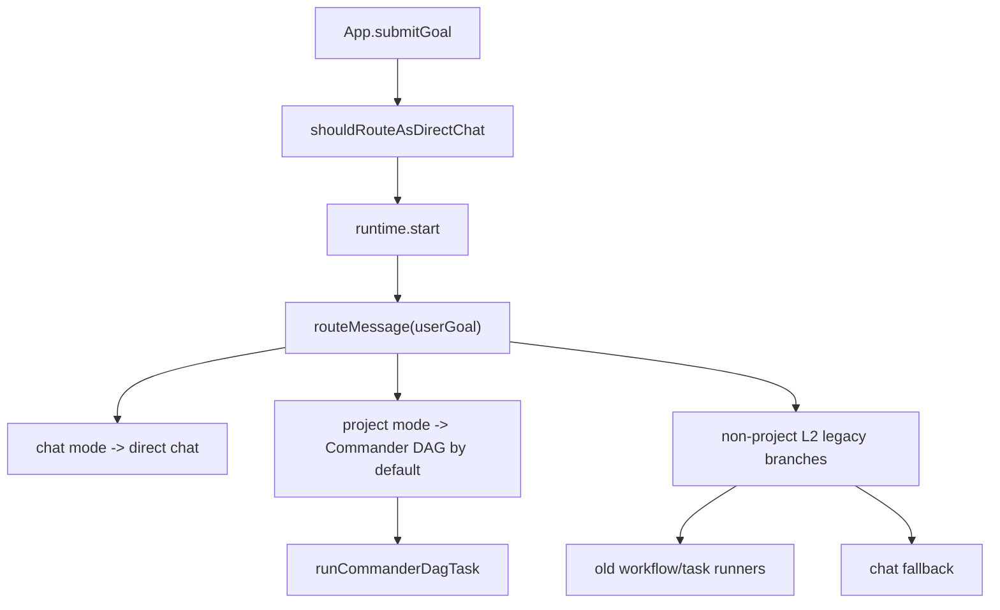
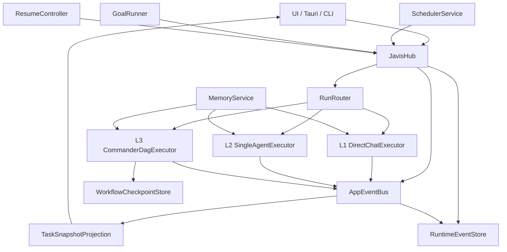

# Javis Runtime 重构方案：参考 OpenHanako 的 Hub、RAG、任务循环、调度器与事件总线

> 状态：设计评审稿
> 目标：修复 Javis 当前“链路跑不通”的系统性问题，而不是继续在单个 executor 或 UI 分支上补丁。
> 参照代码：`D:\test\openhanako-main\openhanako-main`
> Javis 代码：`D:\test\Javis`

## 1. 结论

Javis 当前的主要问题不是 Commander DAG、ReAct、RAG 或某个工具单独坏了，而是运行时没有唯一主干：

- UI 层会先改写 compose mode，core 层又再次路由。
- `project` / Agent 模式下，core 虽然已经计算 `routeMessage()`，但仍把大多数输入推入 Commander DAG。
- 定时任务、current goal 自动续跑、用户输入、DAG executor 各自有提交和停止逻辑。
- `TaskEventBus`、`RuntimeEventStore`、`WorkflowCheckpoint` 都已经存在，但事件还不是快照和恢复的唯一真相源。
- 记忆系统有 prompt 注入、`memory.search` 工具、SQLite FTS/LIKE/vector 混合召回，但入口、scope、audit 没有被一个服务统一。

OpenHanako 值得参考的不是它的角色、人设或频道业务，而是运行边界：

```text
Hub owns EventBus / Scheduler / ChannelRouter / DM Router
Engine receives injected callbacks
All user, bridge, channel, cron, heartbeat messages become routed sessions
Schedulers do not live in React hooks
Actions are toolized and auditable
Events are shared infrastructure, not executor-local details
```

Javis 的目标应该是：

```text
RunEnvelope -> JavisHub -> RunRouter(L1/L2/L3) -> Executor -> AppEventBus
                                      |              |
                                      v              v
                               MemoryService   RuntimeEventStore
                                      |              |
                                      v              v
                              scoped RAG       TaskSnapshot projection
```

## 2. 本次 review 修正

上一版口头方案里有几个点需要收紧或修正：

1. **Javis 不是没有事件持久化。**
   `apps/desktop/src/runtime-event-store.ts` 已经有 append-only `runtime_events` 表，`packages/core/src/workflow-checkpoint.ts` 也有 checkpoint contract。真正的问题是这些能力只在 DAG executor 周边生效，还没有覆盖 L1/L2、scheduler、goal、UI snapshot 投影。

2. **PowerShell 乱码不是源码乱码。**
   多个中文字符串在 PowerShell 输出中显示异常，但用 UTF-8 读取是正常中文。因此不要把“修编码”列为主线任务。

3. **OpenHanako 不是要被照搬。**
   Javis 是桌面 agent workbench，有 Commander DAG、审批、Tauri 工具、安全边界；OpenHanako 是多 agent / phone / channel / cron 架构。我们只借鉴 Hub、EventBus、Scheduler、toolized decision、scoped memory 的边界。

4. **Javis 的 RAG 比 OpenHanako 某些部分更复杂。**
   Javis 已有 SQLite FTS、LIKE、recent facts、optional vector search、embedding provider、injection audit。重构不是移除 vector，而是统一 `prompt memory` 和 `memory.search` 的服务入口。

5. **L2 不能继续只是 legacy branch。**
   当前 `L2` 只是 core `index.ts` 中的一组 hardcoded fallback 分支，并不是真正的 single-agent task runtime。L2 应独立成“单 agent / 单工具 / 小 ReAct”执行器，必要时再升级 L3。

6. **DAG ask_user 递归存在实际链路丢失风险。**
   `packages/core/src/workflow-executor.ts` 中 leading `commander.askUser` 如果是唯一 step，会递归调用 `runCommanderDagTask()`，但没有传递 `runtimeEventSink`、`checkpointSink`、`initialLogs`、`fullPriorMessages`、`contextSummaryTool`、`gitTool` 等上下文。这会导致澄清后的运行丢 durable event、checkpoint、历史消息或工具能力。这个是 P0 战术修复，不必等完整 Hub 重构。

## 3. 代码依据

### 3.1 Javis 当前链路

| 模块 | 文件 | 观察 |
| --- | --- | --- |
| Core 入口 | `packages/core/src/index.ts` | `start()` 内先 `routeMessage(userGoal)`，但 `project` 模式仍默认进入 Commander DAG。 |
| UI 路由 | `apps/desktop/src/App.tsx` | `shouldRouteAsDirectChat()` 在 UI 层把轻量 project 输入改为 `chat`，导致路由真相源分裂。 |
| L2 路由 | `packages/core/src/index.ts` | L2 仍是 URL、read project、write text、research、review、PDF 等 legacy hardcoded branches。 |
| DAG runtime | `packages/core/src/workflow-executor.ts` | 已有 plan compiler、runtime events、checkpoint sink、SharedContext、failure replan，但只覆盖 L3。 |
| 事件总线 | `packages/core/src/task-event-bus.ts` | per-task in-memory bus，有 middleware，但没有 request/handle、capability directory、session/run index。 |
| 快照归约 | `packages/core/src/delta-reducer.ts` | 只处理 streaming、step、ask_user、terminal 的一部分；很多事件仍依赖 full emit。 |
| 事件持久化 | `apps/desktop/src/runtime-event-store.ts` | append-only table 已有，但还不是所有运行路径的事件源。 |
| 调度器 | `apps/desktop/src/use-scheduled-tasks.ts` | React hook 用 interval/focus 检查 due task，提交到 `submitGoalRef.current()`。 |
| 调度终态 | `apps/desktop/src/use-task-runtime.ts` | terminal snapshot 时清理所有 `lastRunStartedAt` task，而不是只清理当前 run 对应 task。 |
| Goal loop | `apps/desktop/src/App.tsx` | `startGoalIteration()` 和 `scheduleGoalContinuation()` 在 App 内部用 `setTimeout` 续跑。 |
| Memory prompt | `apps/desktop/src/app-runtime.ts` | provider 调用前用 `buildAgentMemoryPromptContext` 注入记忆。 |
| Memory tool | `apps/desktop/src/App.tsx` | `searchAgentMemory` 作为工具路径，scope/audit 与 prompt 注入路径相似但不完全同源。 |

### 3.2 OpenHanako 参考点

| 模块 | 文件 | 可借鉴点 |
| --- | --- | --- |
| Hub | `hub/index.ts` | 同进程 orchestrator，持有 EventBus、Scheduler、ChannelRouter、DmRouter，并注入 engine。 |
| EventBus | `hub/event-bus.ts` | `subscribe/emit` + `handle/request` + SKIP chain + capability directory + sessionPath index。 |
| Scheduler | `hub/scheduler.ts` | headless heartbeat/cron，per-job lock，后台任务通过 isolated agent session 执行，完成后发事件。 |
| ChannelRouter | `hub/channel-router.ts` | channel delivery 注入 `channel_read_context`、`channel_reply`、`channel_pass`，强制显式决策。 |
| Memory search | `lib/memory/memory-search.ts` | `search_memory` 支持 conversation scope，默认避免跨频道污染，显式 `cross_channel` 才放开。 |
| FactStore | `lib/memory/fact-store.ts` | SQLite FTS + tag/date search，CJK 搜索有独立测试。 |
| Daily memory | `lib/memory/compile.ts` | daily -> week -> longterm conveyor，fingerprint 防重复编译，适合作为 Javis 长期记忆 P2 参考。 |

## 4. 当前链路问题拆解

### 4.1 路由真相源分裂

当前链路类似：



问题：

- L1/L2/L3 的设计已经写在 `docs/JAVIS_CONVERSATION_FIRST_ARCHITECTURE.md`，但没有成为唯一入口。
- `project` 模式语义被混成“必须走 workflow”，导致普通问候、解释、继续上下文也可能进 DAG。
- UI 层为了修体验提前把 project 改 chat，但这让 core 无法稳定记录真实 route decision。

修复方向：

- UI 不做路由，只提交 `RunEnvelope`。
- core/hub 只在一个地方做 route decision。
- route decision 进入事件流：`run.route_decided`。
- `project` 只是 workspace context，不是 DAG 强制开关。

### 4.2 任务循环分裂

当前至少有四套循环：

1. 用户提交：`App.submitGoal()` -> `runtime.start()`
2. scheduled tasks：`useScheduledTasks()` -> `submitGoalRef.current()`
3. current goal：`scheduleGoalContinuation()` -> `startGoalIteration()` -> `submitGoal()`
4. DAG executor：`executeWorkflow()` 内部 step queue / replan / ask_user / retry

问题：

- 谁能启动任务、谁能延后、谁能取消、谁能恢复，没有统一 coordinator。
- scheduled task 依赖 React interval/focus，不是后台服务。
- current goal 用 UI component 内部 timer 驱动，和 scheduled task / runtime queue 是平行系统。
- 任务终态清理 scheduled state 时按 `lastRunStartedAt` 扫全表，容易误清并发或残留任务。

修复方向：

- `SchedulerService`、`GoalRunner` 都只能通过 `JavisHub.submit()` 创建 run。
- Hub 负责 active run policy、queue policy、cancel/resume。
- 每个 run 都有 `origin`，例如 `user | scheduled | goal | resume | tool_callback`。
- scheduled task 的 `lastRunStartedAt` 必须绑定 `runId`，终态只清理匹配 run。

### 4.3 Event bus 半成品

Javis 已有：

- `TaskEventBus`：per-task event bus。
- `DeltaReducer`：事件到 snapshot 的局部归约。
- `RuntimeEventStore`：SQLite append-only event store。
- `WorkflowCheckpoint`：DAG checkpoint。

缺口：

- `TaskEventBus` 没有全局订阅、request/handle、capability directory。
- L1 direct chat 和 legacy L2 不一定完整进入 runtime event envelope。
- `DeltaReducer` 没覆盖全部 `TaskRuntimeEvent`，很多 UI 状态仍靠手工 full snapshot emit。
- scheduler、goal、memory injection audit 不是统一 runtime events。

修复方向：

- 引入 `AppEventBus` 或升级 `TaskEventBus` 为 app-level bus。
- 所有 executor 只发事件，不直接改 UI snapshot。
- `TaskSnapshot` 成为 event projection。
- `RuntimeEventStore` 保存所有 run event，不仅是 Commander DAG。

### 4.4 RAG 和记忆入口分裂

Javis 现状：

- `agent-memory.ts` 提供 SQLite fact store、FTS、LIKE、recent、vector 合并排序。
- `agent-memory-runtime.ts` 构造 prompt context。
- `App.tsx` 提供 `searchAgentMemory` 给工具调用。
- `app-runtime.ts` 在 provider 前注入 prompt memory。

问题：

- prompt 注入和 tool search 的 scope、audit、ranking 逻辑相似但不完全同源。
- `memoryScope === workspace/global_workspace` 的过滤在不同路径上由不同代码承担。
- RAG 不属于某个 executor，应该是 runtime service。

修复方向：

- 新建 `MemoryService`，统一：
  - `search(request)`
  - `buildPromptContext(runContext)`
  - `recordInjection(event)`
  - `scopePolicy(runContext)`
  - `getScopedSearchTool(runContext)`
- 保留现有 hybrid retrieval，不强行退回 OpenHanako 的纯 FTS/tag。
- 借鉴 OpenHanako 的 conversation-scoped memory，避免 workspace/channel/session 污染。

### 4.5 DAG ask_user 递归丢上下文

当前 `runCommanderDagTask()` 对 leading `commander.askUser` 的特殊处理：

- `dagPlan.steps.length === 1` 时递归调用 `runCommanderDagTask()`。
- 递归参数缺失 durable sinks 和部分工具/context 参数。

影响：

- 澄清后的 run 可能不再写入 `runtime_events`。
- checkpoint 可能中断。
- Git tool 等能力可能丢失。
- prior messages / full prior messages / summary context 可能丢失。
- 事件流上看起来像同一个 task，但内部 run 上下文已经断了。

先修方案：

- 不要用裸递归重启 DAG。
- 将 clarification 写入当前 `SharedTaskContext`，发 `ask_user.responded`，然后进入同一个 run 的 replan 分支。
- 如果短期必须递归，必须传齐所有原始参数：`gitTool`、`runtimeEventSink`、`checkpointSink`、`initialLogs`、`priorMessages`、`fullPriorMessages`、`omittedPriorMessageCount`、`contextSummaryTool`、`availableToolDescriptors`、`runtimeConfig`、`all tool adapters`。
- 递归时不要重置 run sequence；如果确实是新 run，必须显式创建 child run 并发 `run.child_started`。

## 5. 目标架构



### 5.1 RunEnvelope

新增或等价定义：

```ts
export type RunOrigin =
  | "user"
  | "scheduled"
  | "goal"
  | "resume"
  | "tool_callback";

export type RunRequestedMode =
  | "chat"
  | "project"
  | "auto";

export interface RunEnvelope {
  runId: string;
  taskId: string;
  origin: RunOrigin;
  requestedMode: RunRequestedMode;
  userGoal: string;
  displayGoal?: string;
  workspacePath?: string;
  conversationId?: string;
  parentRunId?: string;
  scheduledTaskId?: string;
  goalId?: string;
  attachments?: RuntimeAttachment[];
  priorMessages?: ChatMessage[];
  permissionMode?: string;
  createdAt: string;
}
```

关键规则：

- `workspacePath` 不等于 L3。
- `requestedMode` 是用户意图/入口上下文，不是最终执行路径。
- `routeDecision` 必须由 `RunRouter` 产出，并写入事件。
- 所有 run 必须有 `runId`；`taskId` 可以继续承载 UI history，但 durable runtime 以 `runId` 为主。

### 5.2 AppEventBus

可以参考 OpenHanako `EventBus`，但类型应按 Javis 重写：

```ts
interface AppEventBus {
  emit(event: RuntimeEvent, scope?: EventScope): void;
  subscribe(handler: RuntimeEventHandler, filter?: EventFilter): () => void;
  handle<TInput, TOutput>(
    type: string,
    handler: RequestHandler<TInput, TOutput>,
    options?: CapabilityRegistration,
  ): () => void;
  request<TInput, TOutput>(
    type: string,
    payload: TInput,
    options?: RequestOptions,
  ): Promise<TOutput>;
  listCapabilities(): RuntimeCapability[];
}
```

事件范围：

- `runId`
- `taskId`
- `conversationId`
- `workspacePath`
- `origin`

事件种类建议：

- `run.created`
- `run.route_decided`
- `run.started`
- `run.completed`
- `run.failed`
- `run.cancelled`
- `agent.stream_started`
- `agent.token_delta`
- `agent.stream_completed`
- `step.started`
- `step.completed`
- `step.failed`
- `tool.planned`
- `tool.started`
- `tool.partial`
- `tool.completed`
- `tool.failed`
- `approval.requested`
- `approval.resolved`
- `ask_user.requested`
- `ask_user.responded`
- `scheduler.job_due`
- `scheduler.job_started`
- `scheduler.job_done`
- `goal.iteration_started`
- `goal.evaluated`
- `memory.injected`
- `memory.searched`

### 5.3 RunRouter

L1/L2/L3 的唯一入口：

```ts
export interface RouteDecision {
  level: "L1" | "L2" | "L3";
  mode: "direct_chat" | "single_agent_task" | "commander_dag";
  score: number;
  reasons: string[];
  selectedAgentKind?: AgentKind;
  selectedToolNames?: string[];
  escalationPolicy: "allow" | "deny";
}
```

规则：

- L1：普通对话、解释、继续、低风险建议。一个 streaming LLM call，不给 Commander schema，不给全工具列表。
- L2：明确单步工具任务或单 agent 小任务。只给相关工具，可以一次工具调用或小 ReAct loop。
- L3：多步骤、多 agent、多工具、需要 durable plan/replan/approval 的任务。进入 Commander DAG。

升级：

- L1 执行中发现需要读文件/搜索/审批时，发 `run.escalation_requested`，由 Hub 决定是否升级 L2/L3。
- L2 执行中发现需要多 step 或跨 agent handoff 时，升级 L3。
- 升级必须保留 `parentRunId` 或同 run event continuity，不允许静默新开链路。

### 5.4 Executor 分层

| Executor | 用途 | 禁止事项 |
| --- | --- | --- |
| `DirectChatExecutor` | L1 普通对话、解释、续聊 | 禁止加载 Commander DAG schema；禁止暴露所有工具。 |
| `SingleAgentExecutor` | L2 单 agent / 单工具任务 | 禁止生成完整 DAG；禁止把所有工具塞给模型。 |
| `CommanderDagExecutor` | L3 复杂任务 | 不负责入口路由；不处理 scheduler/goal 提交策略。 |

## 6. 文件级落地建议

### 6.1 Core 层

新增：

- `packages/core/src/runtime/run-envelope.ts`
- `packages/core/src/runtime/app-event-bus.ts`
- `packages/core/src/runtime/run-router.ts`
- `packages/core/src/runtime/runtime-hub.ts`
- `packages/core/src/runtime/executors/direct-chat-executor.ts`
- `packages/core/src/runtime/executors/single-agent-executor.ts`
- `packages/core/src/runtime/executors/commander-dag-executor.ts`
- `packages/core/src/runtime/task-snapshot-projection.ts`

调整：

- `packages/core/src/index.ts`
  - 保留公开 API，但内部委托给 `RuntimeHub`。
  - 移除 project mode 强制 DAG。
  - legacy L2 branches 迁移到 `SingleAgentExecutor` 或工具适配层。
- `packages/core/src/local-router.ts`
  - 升级为 `run-router.ts` 的 heuristic scorer，或作为 scorer helper 保留。
- `packages/core/src/workflow-executor.ts`
  - 只作为 L3 executor。
  - 修复 leading `ask_user` 递归丢上下文。
  - DAG event 必须统一发 AppEventBus，再由 sink 持久化。
- `packages/core/src/delta-reducer.ts`
  - 扩展为完整 projection，或迁移为 `task-snapshot-projection.ts`。

### 6.2 Desktop 层

新增：

- `apps/desktop/src/runtime-hub-adapter.ts`
- `apps/desktop/src/scheduler-service.ts`
- `apps/desktop/src/goal-runner.ts`
- `apps/desktop/src/memory-service.ts`
- `apps/desktop/src/runtime-projection-store.ts`（可选，如果 projection 需要持久缓存）

调整：

- `apps/desktop/src/app-runtime.ts`
  - 从“创建一个巨大 runtime + 工具注入”变成“组装 Hub adapters”。
  - provider、Tauri invoke、tool audit、approval gateway、memory service 都作为 adapter 注入。
- `apps/desktop/src/App.tsx`
  - 删除 `shouldRouteAsDirectChat()` 对 compose mode 的最终决策权。
  - `submitGoal()` 只创建 `RunEnvelope`，交给 Hub。
  - current goal continuation 移到 `GoalRunner`。
- `apps/desktop/src/use-scheduled-tasks.ts`
  - 只保留 scheduled task UI CRUD hook，due execution 移到 `SchedulerService`。
- `apps/desktop/src/use-task-runtime.ts`
  - 不再按 `lastRunStartedAt` 扫全表清理；用 `scheduledTaskId + runId` 精确更新。
- `apps/desktop/src/agent-memory-runtime.ts`
  - 变成 `MemoryService` 的 formatter/helper，不再由 App 和 provider 各自拼接策略。

## 7. 分阶段计划

### Phase 0：先修和 characterization tests

目标：不改大架构，先把最容易断链的点钉住。

必须做：

- 增加测试：`project` 模式输入 `你好` 必须 L1，不调用 `commanderTool.plan`。
- 增加测试：`runCommanderDagTask` leading `ask_user` 澄清后仍调用 `runtimeEventSink.append` 和 `checkpointSink.save`。
- 修复 `ask_user` 递归丢参数问题。
- 增加测试：scheduled task terminal 只清理当前 scheduled task/run。
- 增加测试：prompt memory 和 `memory.search` 在 workspace/global scope 下结果一致或差异明确。

验收：

- 不引入 Hub 也能先消除 P0 断链。
- 所有新增测试能稳定复现当前问题并在修复后通过。

### Phase 1：Hub 外壳，不改行为

目标：先有唯一提交入口，但内部仍可调用旧 runtime。

工作：

- 引入 `RunEnvelope`。
- 引入 `JavisHub.submit(envelope)`。
- `App.submitGoal()`、scheduled task、goal continuation 全部改为提交 envelope。
- Hub 内部暂时委托旧 `runtime.start()`。
- 每个提交发事件：`run.created`、`run.started`、`run.completed/failed/cancelled`。

验收：

- UI 行为基本不变。
- 每个 task history entry 能追到 `runId` 和 `origin`。
- scheduled/goal/user run 在事件流中可区分。

### Phase 2：统一 Router，落地 L1

目标：让 `Conversation-first, Workflow-on-demand` 真正进入主链路。

工作：

- 将 UI 的 direct chat 判断移入 `RunRouter`。
- `project` 模式不再强制 DAG。
- L1 走 `DirectChatExecutor`，支持 streaming events。
- RouteLog 改为 `run.route_decided` event。

验收：

- `你好`、`继续`、`这个是什么意思` 在 project/workspace 上下文中仍是 L1。
- L1 不触发 Commander plan，不创建 DAG checkpoint。
- UI 能展示 streaming token，而不是等待完整 snapshot。

### Phase 3：L2 SingleAgentExecutor

目标：把“单步工具任务”从 legacy branch 里抽出来。

工作：

- 基于 tool descriptors 做 capability selection。
- 支持 direct tool invocation。
- 支持 bounded small ReAct，但只给相关工具。
- 支持 ask_user 缺参澄清。
- 支持升级 L3。

验收：

- `总结这个文件`、`搜索当前仓库里的 memory 代码`、`读取 README` 不走 Commander DAG。
- L2 的 tool events、memory events、ask_user events 都能 replay。
- L2 升级 L3 时保留 run continuity。

### Phase 4：SchedulerService 和 GoalRunner

目标：移除 React hook / App timer 对后台执行的控制权。

工作：

- `SchedulerService` 负责 due scan、per-job lock、run submission、timeout/abort。
- scheduled task 状态增加 `activeRunId` 或运行记录表。
- `GoalRunner` 负责 continuation decision 和下一轮 envelope。
- UI hook 只做 CRUD 和显示。

验收：

- 窗口不 focus 时也能调度（在桌面进程可用时）。
- 同一 scheduled job 不并发。
- task terminal 只更新对应 job/run。
- current goal 的每次迭代都有 `origin: "goal"` 和 parent/previous run 关系。

### Phase 5：AppEventBus 和完整 projection

目标：事件成为 UI 快照和恢复的唯一真相源。

工作：

- 扩展 `TaskRuntimeEvent` 或新增 `RuntimeEvent`。
- `DeltaReducer` 覆盖全部事件类型。
- `RuntimeEventStore` 保存 L1/L2/L3/scheduler/goal/memory events。
- UI 订阅 projection，不直接依赖 executor 手工 snapshot。

验收：

- live projection 与 event replay projection 一致。
- 重启后可从 event store 恢复最后状态。
- 手工 full snapshot emit 只作为迁移期 fallback。

### Phase 6：MemoryService / RAG 收敛

目标：prompt 注入和工具检索共用同一记忆服务。

工作：

- `MemoryService.search()` 统一 scope、ranking、audit。
- `MemoryService.buildPromptContext()` 调用同一 search policy。
- `memory.search` tool 由 MemoryService 生成 scoped tool。
- 记录 `memory.searched` 和 `memory.injected` events。
- 可选 P2：参考 OpenHanako daily conveyor 做长期记忆压缩。

验收：

- workspace-only 不泄漏 global-only fact，除非设置允许。
- global_workspace 下的 workspace + global 合并行为一致。
- prompt 注入和 tool search 的审计日志结构一致。

### Phase 7：清理 legacy branches

目标：让 `packages/core/src/index.ts` 从巨型入口变为 facade。

工作：

- 删除或迁移 legacy workflow branches。
- `runCommanderDagTask` 不再知道入口路由策略。
- `app-runtime.ts` 不再承担 memory/scheduler/goal 路由职责。

验收：

- 新增功能只需要注册 tool/capability/executor，不需要改 `index.ts` 大分支。
- `pnpm test` 中路由、scheduler、memory、event replay contract 覆盖主链路。

## 8. 优先修复清单

### P0

- 修复 `runCommanderDagTask()` leading `ask_user` 递归丢 sink/context/tool 参数。
- project mode 不再默认把 L1 输入推入 Commander DAG。
- scheduled task terminal 更新只影响当前 job/run。
- `RunEnvelope` / `runId` 贯穿 user、scheduled、goal。
- `runtimeEventSink` 覆盖 L1 direct chat。

### P1

- Hub shell 接管所有 submit path。
- `RunRouter` 成为唯一 route decision owner。
- `DeltaReducer` 覆盖所有 task runtime events。
- `MemoryService` 统一 prompt 注入和 tool search。
- L2 executor 替换 legacy hardcoded branches。

### P2

- EventBus request/handle + capability directory。
- SchedulerService headless due loop。
- GoalRunner service。
- long-term memory conveyor。
- channel/external message toolized decision protocol。

## 9. 测试矩阵

| 场景 | 期望 |
| --- | --- |
| `runtime.start("你好", { mode: "project" })` | L1 direct chat；不调用 `commanderTool.plan`；发 `run.route_decided`。 |
| `runtime.start("继续", { mode: "project" })` | L1，携带 prior messages，不进 DAG。 |
| `runtime.start("总结这个文件", { mode: "project" })` | L2；缺文件时 ask_user；有文件时 file/read + synthesis。 |
| `runtime.start("重构这个项目并给出方案", { mode: "project" })` | L3 Commander DAG。 |
| Commander plan 只有 `commander.askUser` | 澄清后同 run replan；runtime events/checkpoints 不丢。 |
| scheduled job due | `scheduler.job_started` -> Hub run；job 带 `activeRunId`。 |
| scheduled job completed | 只更新匹配 `scheduledTaskId + runId` 的 job。 |
| current goal continuation | 每轮是 `origin: "goal"`，可追 parent run。 |
| memory prompt injection | 发 `memory.injected`；scope 和 tool search 一致。 |
| memory tool search | 发 `memory.searched`；workspace/global policy 可测试。 |
| event replay | replay 后 `TaskSnapshot` 等于 live projection terminal snapshot。 |

## 10. 风险与约束

1. **不要在 Phase 1 直接重写 Commander DAG。**
   DAG executor 已经承载审批、checkpoint、failure replan，先把它放到 L3 边界里。

2. **不要让 Hub 变成新的巨型 App.tsx。**
   Hub 负责 orchestration，不负责具体 Tauri invoke、provider 调用、DB SQL；这些用 adapters 注入。

3. **不要把 L2 做成第二个 Commander。**
   L2 的价值是低延迟、少工具、少 prompt、少不确定性。复杂就升级 L3。

4. **不要移除现有安全审批链。**
   File/Git/Browser/Terminal 的 native approval binding、preview hash、one-shot consumption 必须保留。

5. **不要把 memory vector 当成第一优先级。**
   当前首要问题是 scope 和入口一致性；vector 只是召回策略之一。

6. **不要依赖 React 生命周期执行后台任务。**
   UI 可以展示和编辑 scheduled tasks，但 due scan、lock、run submission 必须在 service 层。

## 11. 推荐 PR 拆分

1. `fix(runtime): preserve sinks and context across ask-user DAG replan`
2. `test(runtime): characterize L1/L2/L3 route decisions in project mode`
3. `feat(runtime): introduce RunEnvelope and JavisHub facade`
4. `feat(runtime): move direct-chat routing into RunRouter`
5. `feat(runtime): persist L1 runtime events`
6. `feat(scheduler): add SchedulerService with run-bound job state`
7. `feat(goal): move goal continuation into GoalRunner`
8. `feat(memory): introduce MemoryService and scoped search API`
9. `feat(runtime): add SingleAgentExecutor for L2`
10. `refactor(runtime): reduce index.ts legacy branches`

## 12. 最小可验收里程碑

第一阶段不要追求“全新架构全部完成”。最小可验收目标是：

- `你好` 在 project mode 不再进入 Commander。
- leading `ask_user` 不再丢 runtime event/checkpoint。
- scheduled task 不再由 React focus/interval 独占控制执行真相。
- 每个 run 都有 `runId/origin/routeDecision`，并能在 event store 中追踪。
- memory prompt 和 memory tool 共享同一 scope policy。

做到这五点后，Javis 的链路会从“多个局部聪明系统互相抢方向盘”，变成“一个 Hub 主干调度多个 executor”。这才是后续修 ReAct、DAG、RAG、审批恢复的稳固地基。
